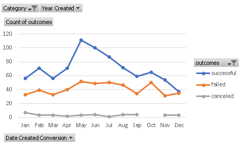
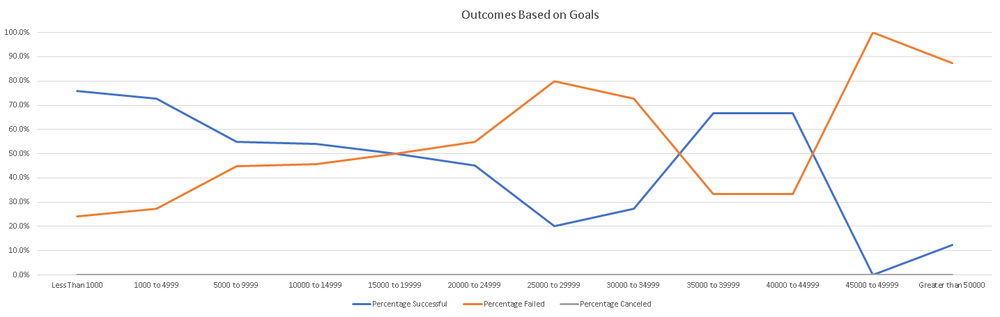

# Kickstarting with Excel

## Project Background and Purpose

A client is interested in using Kickstarter, a crowd funded project platform, to help guide decision making for launching her play, *Fever*.  Kickstarter is a place where individuals are able to post their projects to in hope of finding investors.  The client would like to know more about what makes a successful play in the U.S based on historical evidence to help guide her goals to create a successful project.  In additiona, the client also has interest in expanding to Great Britain in the future so additional information on success in that location is needed.

## Analysis and Challenges
Over 4000 Kickstarter Projects from around the globe were analyzed using various Excel functions to help better understand what makes a project successful.  The data included projects of various categories (movies, music, and games).  The focus of this analysis was on plays performed in the U.S. 

### Analysis of Outcomes Based on Launch Date
One part of the analysis performed was to look at the affect that time of year that a project was launched on had on that outcome.  As demonstrated in the image below,  an increased success rate is seen from May through July with May being the peak.  The number of failed projects stays fairly consistent throughout the year with an average of 41.1 failled projects per month. 

### Analysis of Outcomes Based on Goals
The amount of money needed for a project also plays a role on how successful (or unsuccessful) a project may be.  As displayed below.  Lower monetary goals (less than $5000) appear to have better success rates while projects with goals greater then $45,000 have significantly decreased success rate.  The success or failure is not completely linear though.  The analysis also displayed an increased success rate between $35,000 to $49,999.

### Challenges and Difficulties Encountered

## Results

### What are two conclusions you can draw about the Outcomes based on Launch Date?
Two conclusions drawn for the anlaysis of outcomes based on launch date:
1. The highest number of play projects are launched during May and that month has the highest success rate. 
2. December has the least number of projects launched and has the lowest success rate of all the months.  

### What can you conclude about the Outcomes based on Goals?
The highest success rate is seen with projects that have goals of <$1000 and are least successful when the goal is >$50,000

### What are some limitations of this dataset?
This data set is limited to just projects launched on the Kickstarter platform.  There are many other crowd funding platforms available that may be more (or less) popular based on geographical region or category of the project.   

### What are some other possible tables and/or graphs that we could create?
An additional graph that could be use is looking at outcome based on launch date as a percentage rather than a count.  While looking at it as a count allows the viewer to be able to see the most popular launch month, I feel that viewing as a percentage allows for a better comparision.  
INSERT GRAPH
One other interesting metric to look at would be success rates by country. After creating the graph based on count, it is clear that Kickstarter is much more popular in the United States with Great Britian coming in second.  In this case looking at the chart as a percentage might not give an accurate picture since some cournties have a very small project count when compared to the number coming from the United States.  

